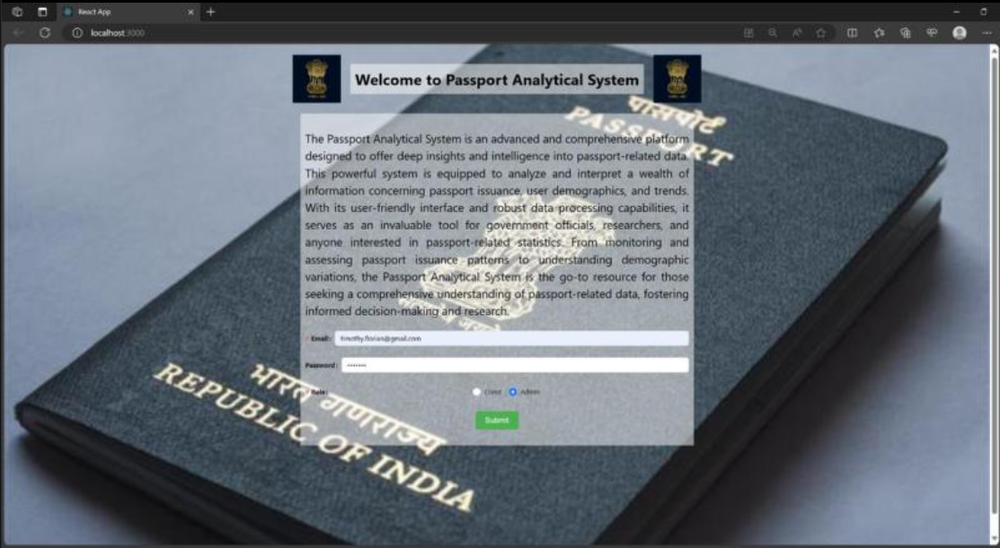

# Passport Analytical System

##  Project Overview

The **Passport Analytical System** is a web-based application built using the **MERN stack** (MongoDB, Express.js, React, Node.js) to analyze and visualize passport-related data. It provides insights into passport issuance trends, revenue generation, and user analytics.

## Table of Contents

1. [Project Overview](#project-overview)
2. [Features](#features)
3. [Tech Stack](#tech-stack)
4. [Folder Structure](#folder-structure)
5. [Installation & Setup](#installation--setup)
   - [Clone the Repository](#1-clone-the-repository)
   - [Backend Setup](#2-backend-setup)
   - [Frontend Setup](#3-frontend-setup)
6. [API Endpoints](#api-endpoints)
7. [Screenshots](#screenshots)
8. [References](#references)
9. [Contributors](#contributors)

---

##  Features

- **User Authentication:** Secure login and registration system.
- **Passport Data Analysis:** Query and visualize passport issuance data.
- **Role-Based Access:** Admin and client-based access control.
- **Interactive Dashboard:** Graphs and tables for better data representation.
- **MongoDB Aggregations:** Complex queries for insightful analytics.

##  Tech Stack

- **Frontend:** React.js, Ant Design (UI Components)
- **Backend:** Node.js, Express.js
- **Database:** MongoDB with Mongoose ODM
- **Authentication:** JWT-based authentication

---

##  Folder Structure

```
Passport-Analysis-System/
│── backend/                  # Backend (Node.js, Express, MongoDB)
│   ├── config/               # Database configurations
│   ├── controllers/          # API controllers
│   ├── models/               # Mongoose schemas
│   ├── routes/               # API routes
│   ├── middleware/           # Authentication middleware
│   ├── .env                  # Environment variables
│   ├── server.js             # Main backend entry point
│   ├── package.json          # Backend dependencies
│── frontend/                 # Frontend (React, Ant Design)
│   ├── src/                  # React source files
│   ├── public/               # Public assets
│   ├── package.json          # Frontend dependencies
│── docs/                     # Documentation
│   ├── README.md             # Project overview and setup
│   ├── API_DOCS.md           # API documentation
│── .gitignore                # Git ignore file
│── README.md                 # Project overview
```

---

##  Installation & Setup

### 1️ Clone the Repository
```bash
git clone https://github.com/anna123venkat/Passport-Analysis-System.git
cd Passport-Analysis-System
```

### 2️ Backend Setup
```bash
cd backend
npm install
```
- Create a `.env` file in the `backend/` directory and add:
  ```
  PORT=8080
  MONGO_URI=your_mongodb_uri
  JWT_SECRET=your_secret_key
  ```

- Start the backend server:
  ```bash
  npm start
  ```

### 3️ Frontend Setup
```bash
cd frontend
npm install
npm start
```

---

##  API Endpoints

| Method | Endpoint | Description |
|--------|---------|-------------|
| POST   | /api/register | Register a new user |
| POST   | /api/login | Authenticate user |
| GET    | /api/query1 | Query passport data based on year & category |
| GET    | /api/query2 | Get passport issue count per Kendra |
| GET    | /api/query3 | Get revenue generated by Kendras |
| GET    | /api/query4 | Get top Kendras for Tatkal passports |

---

## Screenshots

 **Home Page**  
  
 
 **Login Page**  
  
 
 **Dashboard**  
  

---

## References

1. **MERN Stack Documentation**: For more information on the MERN stack, check the official documentation:
   - [MongoDB](https://www.mongodb.com/docs/)
   - [Express.js](https://expressjs.com/)
   - [React.js](https://reactjs.org/)
   - [Node.js](https://nodejs.org/en/)

2. **JWT Authentication**: For guidance on implementing JWT-based authentication in Node.js:
   - [JWT.io](https://jwt.io/)

3. **Ant Design**: For the UI components used in the frontend:
   - [Ant Design Docs](https://ant.design/docs/react/introduce)

4. **MongoDB Aggregation Framework**: For complex queries and aggregations in MongoDB:
   - [MongoDB Aggregations](https://www.mongodb.com/docs/manual/aggregation/)

5. **Node.js & Express.js**: Official guides on setting up and using Node.js and Express:
   - [Node.js Docs](https://nodejs.org/en/docs/)
   - [Express.js Docs](https://expressjs.com/en/starter/installing.html)

---


##  Contributors

- **[Prasanna Venkatesh S](https://github.com/anna123venkat)**
- **[Timothy Florian](https://github.com/TimothyFlorian)**
- **[Jospar Millian](https://github.com/saspa109)**

---
